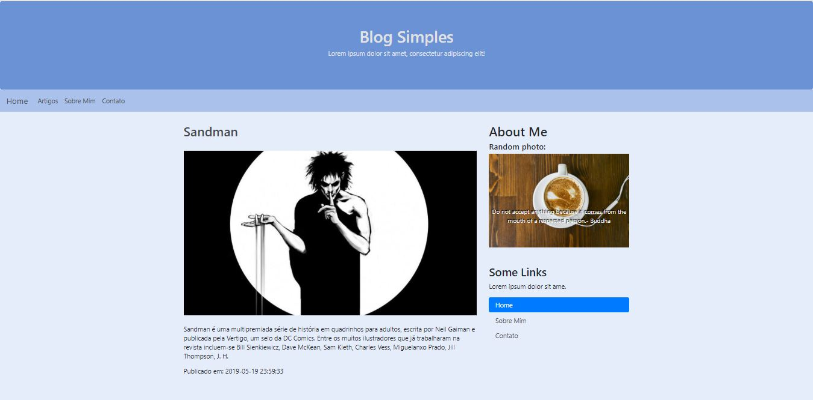

# Blog Simples
> Laravel project of a simple personal blog.

Implemented using the PHP framework [Laravel](https://laravel.com/) and the Dependency Manager for PHP [Composer](https://getcomposer.org/)

## Motivation
This project is for a college course.

## Table of Contents
* [Technology Stack](#technology-stack)
* [Requirements](#requirements)
* [Instalattion](#instalattion)
* [Operation](#operation)
* [Preview](#preview)
* [Credits](#made-by)

## Technology Stack
PHP, JS, HTML, CSS, Bootstrap.
Apache, MySQL.

## Requirements
* PHP >= 5.4
* Apache >= 2.4
* MySQL >= 8.0

## Instalattion

    1. Download the repository

To view with Apache and MySQL

    2. Run Apache and MySQL

With Apache and MySQL running

    3. Open a browser and enter http://localhost/blog_simples/public/home

## Operation
> The navigation is simple, you can go to any page from wherever you are. Fully responsive can be seen from any device don't matter the screen size.

## Preview

## MADE BY 

### IFCE Campus Cedro
* Ariel Bandeira – [@twainariel](https://twitter.com/TwainAriel) – arieltwain@gmail.com
* Jordanna Hellen – jordanna@gmail.com
* Ramon – ramon@gmail.com
* Kelly – kelly@gmail.com
